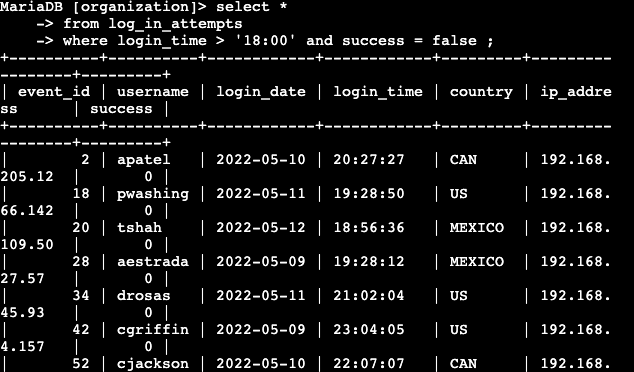
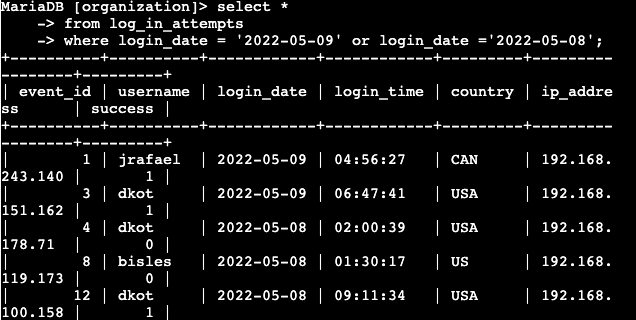
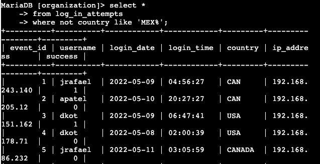
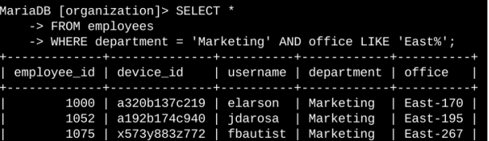
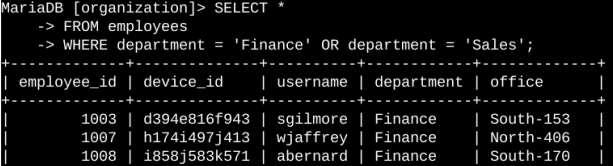
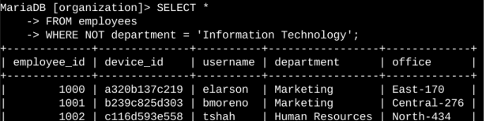

# Apply Filters to SQL Queries

## Project description

My organization is working to make its system more secure. My job is to investigate potential security issues and update employee computers as needed. The following sections demonstrate how I used SQL with filters (AND, OR, NOT, LIKE) to perform security-related tasks.

---

## Retrieve after-hours failed login attempts

There was a potential security incident that occurred after business hours (after 18:00). All after-hours login attempts that failed need to be investigated.

Query used:
```sql
SELECT *
FROM log_in_attempts
WHERE login_time > '18:00' AND success = FALSE;
```



This query filters for failed login attempts that occurred after 18:00. I selected all data from the `log_in_attempts` table, then used a `WHERE` clause with an `AND` operator to combine two conditions: `login_time > '18:00'` filters for attempts after 6 PM, and `success = FALSE` filters for failed attempts only. Both conditions must be true for a row to appear in the results.

---

## Retrieve login attempts on specific dates

A suspicious event occurred on 2022-05-09. Login activity on that day and the day before needs to be investigated.

Query used:
```sql
SELECT *
FROM log_in_attempts
WHERE login_date = '2022-05-09' OR login_date = '2022-05-08';
```



This query returns all login attempts on 2022-05-09 or 2022-05-08. I used a `WHERE` clause with an `OR` operator since either condition can be true for the row to be included — the date just needs to match one of the two specified dates.

---

## Retrieve login attempts outside of Mexico

After reviewing login attempt data, I identified a need to investigate login attempts that occurred outside of Mexico.

Query used:
```sql
SELECT *
FROM log_in_attempts
WHERE country NOT LIKE 'MEX%';
```



This query returns all login attempts from countries other than Mexico. I used `NOT` combined with `LIKE` and the `MEX%` pattern, since the dataset represents Mexico as both `MEX` and `MEXICO`. The `%` wildcard matches any number of characters after `MEX`, ensuring both variations are excluded.

---

## Retrieve employees in Marketing

My team needs to update computers for Marketing department employees in the East building.

Query used:
```sql
SELECT *
FROM employees
WHERE department = 'Marketing' AND office LIKE 'East%';
```



This query returns all Marketing employees located in the East building. I used `AND` to combine two conditions: `department = 'Marketing'` and `office LIKE 'East%'`. The `LIKE` operator with the `%` wildcard matches any office number that starts with "East" (e.g., East-170, East-320).

---

## Retrieve employees in Finance or Sales

A different security update is needed for employees in the Finance and Sales departments.

Query used:
```sql
SELECT *
FROM employees
WHERE department = 'Finance' OR department = 'Sales';
```



This query returns employees from either the Finance or Sales department. I used `OR` instead of `AND` because an employee only needs to belong to one of these two departments to be included in the results.

---

## Retrieve all employees not in IT

The final security update applies to all employees outside the Information Technology department.

Query used:
```sql
SELECT *
FROM employees
WHERE department != 'Information Technology';
```



This query returns all employees who are not part of the Information Technology department. I used the `NOT` (or `!=`) operator to exclude rows where the department matches "Information Technology".

---

## Summary

I applied SQL filters to retrieve specific information on login attempts and employee records across two tables, `log_in_attempts` and `employees`. I used the `AND`, `OR`, and `NOT` operators to combine and exclude conditions, and the `LIKE` operator with the `%` wildcard to match text patterns. These queries helped identify potential security incidents and target employee machines for updates.
