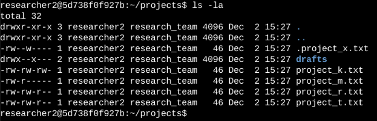
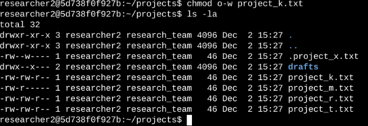
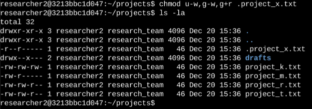
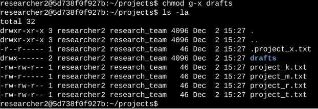

# File Permissions in Linux

## Project description

The research team needed updated file permissions for the `projects` directory. The current permissions did not match the required authorization level. I checked and updated these permissions to help secure the system, following the principle of least privilege.

---

## Check file and directory details

Command used: `ls -la`

This command lists all contents of a directory, including hidden files (starting with `.`), along with permissions, owner, group, size, and last modified date.

The output showed a directory named `drafts`, a hidden file `.project_x.txt`, and other project files. The 10-character string in the first column represents the permissions for each item.

---

## Describe the permissions string

Example: `-rw-rw-r--`

| Characters | Meaning |
|:---|:---|
| 1st (`-`) | regular file (not a directory) |
| 2nd-4th (`rw-`) | user can read and write |
| 5th-7th (`rw-`) | group can read and write |
| 8th-10th (`r--`) | others can only read |

*If the first character was `d`, it would indicate a directory instead of a file.*

---

## Change file permissions

**Issue found:** `project_k.txt` had write access for "others", which violated the policy.

Command used: `chmod o-w project_k.txt`

This removed write permission for "others". I then ran `ls -la` again to confirm the change.

---

## Change file permissions on a hidden file

**File:** `.project_x.txt`

**Requirement:** user and group should have read access only (no write); others should have no access.

Commands used:
- `chmod u-w,g-w .project_x.txt` → removed write access for user and group
- `chmod g+r .project_x.txt` → added read access for group

---

## Change directory permissions

**Directory:** `drafts`

**Requirement:** only `researcher2` should have execute (access) permissions.

Command used: `chmod g-x drafts`

The group previously had execute permissions, so I removed them. The user `researcher2` already had execute permissions, so no further changes were needed.

---

## Summary

I used `ls -la` to check the permissions of files and directories in the `projects` directory. Based on this, I used `chmod` to: remove write access for "others" on `project_k.txt`, restrict `.project_x.txt` to read-only for user and group, and limit execute access on the `drafts` directory to `researcher2` only. These changes align the system with the principle of least privilege.
